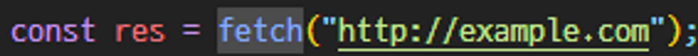
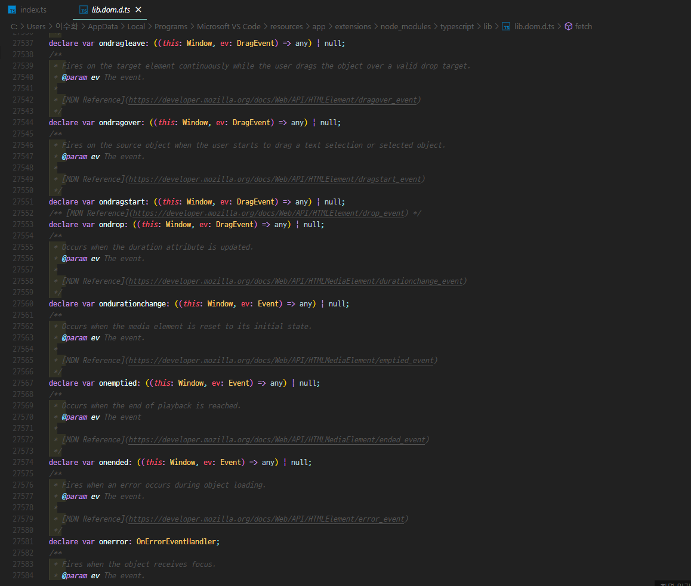
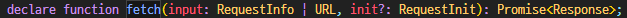

### 이번 item에서 알아볼 것

타입스크립트를 설치하면 두 가지를 실행할 수 있다.

1. 타입스크립트 컴파일러 (tsc)
2. 타입스크립트 서버 (tsserver)

이번 장에서는 편집기를 통해 위의 내용을 자세히 알아볼 것이다.

---

### 타입 선언 파일을 찾는 방법

이런 파일이 있다고 할 때, fetch에 대해 더 알아보고 싶다면, fetch에 더블 클릭을 하고 `**F12번**`을 누른다.

이와 같은 lib.dom.d.ts 파일로 이동하게 된다.

여기서 fetch는 Promise를 반환하고, 두 개의 매개변수를 받는 것을 볼 수 있다.

> **타입 선언**은 처음에는 이해하기 어렵지만 타입스크립트가 무엇을 하는지, 어떻게 라이브러리가 쓰이는지 등을 알 수 있는 도구로 사용할 수 있다.

---

### 요약

1. 편집기에서 타입스크립트 언어 서비스를 적극 활용해야 한다.
2. 편집기를 사용하면 어떻게 타입 시스템이 동작하는지, 그리고 타입 스크립트가 어떻게 타입을 추론하는지 개념을 잡을 수 있다.
3. 타입스크립트가 동작을 어떻게 모델링하는지 알기 위해 타입 선언 파일을 찾아보는 방법을 터득해야 한다.
