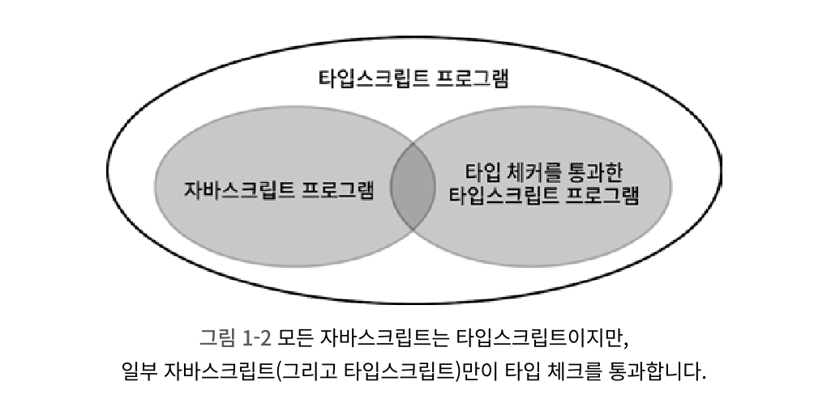
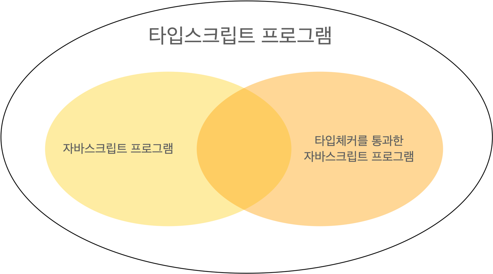

# Item1 타입스크립트와 자바스크립트의 관계 이해하기

#### 타입스크립트와 자바스크립트의 관계 이해하기

> 타입스크립트는 자바스크립트의 상위 집합이다.
> 일부 자바스크립트(그리고 타입스크립트)만이 타입 체크를 통과한다.


모든 자바스크립트는 타입스크립트이지만, 타입스크립트는 자바스크립트가 아닐 수도 있다.

<p align="center">
 
</p>

위의 그림을 보면 타입체커를 통과한 타입스크립트 프로그램이 우리가 평소에 쓰는 interface나 type을 이용해 타입구문을 추가하는 부분들은 자바스크립트가 아니라는 것.

타입스크립트는 자바스크립트 런타임 동작을 모델링하는 타입 시스템을 가지고 있기 때문에 런타임 오류를 잡아낼 수 있지만, 모든 런타임 오류를 잡아낼 수는 없다.

<p align="center">
 
</p>

자바스크립트 런타임으로 돌리면 정상 동작하지만, 타입체커는 통과못해서 문제점이 표시되는 코드 예시

```c
const a = null + 7; // 자바스크립트에서는 a값이 7이 되지만, 타입체커는 통과하지 못함.
const b = [] + 12; // 자바스크립트에서는 b값이 12가 되지만, 타입체커는 통과하지 못함.
```